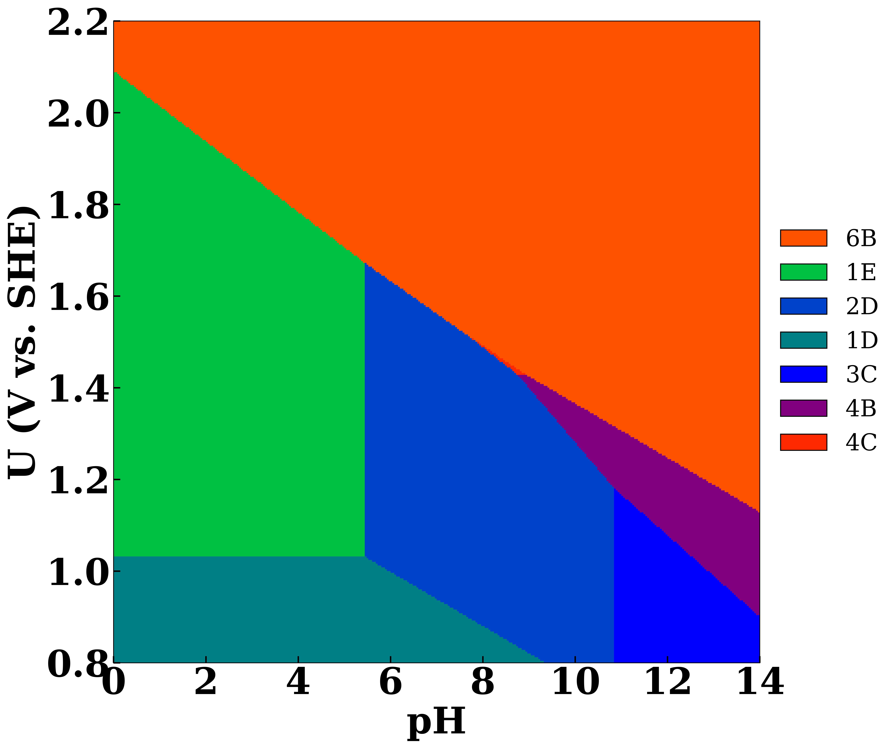

# TAIP map for Iridium oxide clusters

Build a **potential–pH (Pourbaix) diagram** for a catalyst directly from
first-principles energies, by **brute-force grid sampling** ("tiles") rather than
by analytically solving for the equilibria between species.

The repository introduces the method and applies it, as a worked case study, to
the iridium-oxide oxygen-evolution catalyst of Bhattacharyya, Poidevin & Auer
(*J. Phys. Chem. C* 2021).

<p align="center">
  
</p>

The legend uses short species **codes** to keep the figure uncluttered. Each code
decodes to a cluster as follows (the implicit Ir₃O₄ core is dropped, matching the
convention of the published figure), with the corresponding region number in
Bhattacharyya et al.:

| Code | Cluster (this work)            | Bhattacharyya region |
|------|--------------------------------|----------------------|
| 1D   | Ir₃(OH)₅(H₂O)₅⁺                 | (1)                  |
| 1E   | Ir₃(OH)₅(H₂O)₅²⁺                | (2)                  |
| 2D   | Ir₃(OH)₆(H₂O)₄⁺                 | (3)                  |
| 3C   | Ir₃(OH)₇(H₂O)₃                  | (4)                  |
| 4B   | Ir₃(OH)₁₀⁻                      | (5)                  |
| 5B   | Ir₃(OH)₃O₇⁻                     | (7)                  |
| 6B   | Ir₃(OH)₂O₈⁻                     | (8)                  |
| 4C   | Ir₃(OH)₁₀ (neutral)            | — (not in the published set) |

(Code = cluster ranked by H content + charge letter A=−2, B=−1, C=0, D=+1, E=+2;
see [`data/README.md`](data/README.md). The published labels use the μ₁ on-top
notation, e.g. our Ir₃(OH)₅ ≡ Ir₃(OHμ₁)₅.)

## Why this approach?

The textbook way to draw a Pourbaix diagram is to work out, *by hand*, every
equilibrium between every pair of species: the `pKa` of each
protonation/deprotonation step, the equilibrium potential of each redox step, the
Nernst line for each proton-coupled electron transfer, and then the intersections
of all those lines that bound each stability field. With a handful of species
this is tractable. With dozens of charge and protonation states of a nanoparticle
cluster it becomes a bookkeeping nightmare and a frequent source of error.

**This method needs none of that.** The only physics it uses is a single
closed-form expression for the relative free energy of *one* species as a
function of `U` and `pH`. The procedure is then purely mechanical:

1. lay a fine grid over the potential–pH plane;
2. evaluate that free energy for **every** species at **every** grid cell;
3. colour each cell by whichever species is lowest in energy there.

No pairwise equilibria, no `pKa` values, no equilibrium-potential algebra, no
line-intersection geometry. The phase boundaries are never solved for — they
simply *emerge* as the contours where the lowest-energy species changes. Adding a
new candidate species, charge state, or protonation level means adding a row to a
table, not re-deriving the diagram.

## Case study: IrOₓ for the oxygen evolution reaction

We apply the method to the system of:

> Bhattacharyya, K.; Poidevin, C.; Auer, A. A. *Structure and Reactivity of
> IrOₓ Nanoparticles for the Oxygen Evolution Reaction in Electrocatalysis: An
> Electronic Structure Theory Study.* **J. Phys. Chem. C** 2021, *125*,
> 4379–4390. DOI: [10.1021/acs.jpcc.0c10092](https://doi.org/10.1021/acs.jpcc.0c10092)

Iridium oxide (IrOₓ) is the benchmark anode catalyst for the oxygen evolution
reaction (OER) in acidic water electrolysers. Bhattacharyya et al. model the
nanoparticle as a finite molecular cluster (`Ir₃(Oμ₁)₄(OHμ₁)₄(H₂O)₆`, here written
as `Ir_3_O_4_OH_5_H2O_5` and relatives), with geometries and energies from
molecular (Gaussian-basis) DFT using **ORCA**. Under operating conditions the
cluster exchanges **electrons** with the electrode (changing its net charge `q`)
and **protons** with the solvent (changing its hydrogen count `n`). The most stable
state therefore moves across the `U`–`pH` plane: protonated, hydroxyl-rich species
dominate at low potential, and deprotonation/oxidation takes over as the potential
rises toward the ~1.53 V vs. SHE OER onset.

## Comparison with the published diagram

Compare the reconstruction above with the published potential–pH diagram of
Bhattacharyya et al. (their numbered regions 1–8), available from the publisher at
[10.1021/acs.jpcc.0c10092](https://doi.org/10.1021/acs.jpcc.0c10092](https://pubs.acs.org/cms/10.1021/acs.jpcc.0c10092/asset/images/large/jp0c10092_0004.jpeg). Over most of the
plane the tile reconstruction recovers the published topology:

- **Regions 1–5 and 8 are reproduced in the same positions** (and, by coincidence
  of palette, similar colours): the protonated/hydrated cations `Ir₃(OH)₅(H₂O)₅⁺`
  (1) and `²⁺` (2), `Ir₃(OH)₆(H₂O)₄⁺` (3) and `Ir₃(OH)₇(H₂O)₃` (4) at low
  potential/low pH, the deprotonated `Ir₃(OH)₁₀⁻` (5), and the fully oxidised
  `Ir₃(OH)₂O₈⁻` (8) dominating the high-potential region.
- **The intermediate oxo regions (6) and (7) are not resolved here.** This curated
  eight-species table does not include published species (6) `Ir₃(OH)₆O₄⁻`, and
  species (7) `Ir₃(OH)₃O₇⁻` (code `5B`) is present but is never the lowest-energy
  state under these energies, so the small (6)/(7) wedge in the upper-right is
  absorbed by the neighbouring (8) domain. Supplying the full species list would
  restore them.
- A thin **neutral `Ir₃(OH)₁₀` (4C)** slice appears along the (4)/(5) boundary — a
  species not drawn separately in the published figure.

The agreement over regions 1–5 and 8 confirms that the tiles method, fed the same
cluster energies, reproduces the published diagram; the differences are entirely a
consequence of *which species are included in the input table*, not of the method.

## The free-energy expression

At the centre `(U, pH)` of each cell the relative Gibbs free energy of species *i*
is evaluated against a fixed reference species (Eq. 4 of Bhattacharyya et al.):

```
dG_i(U, pH) = (mu_i - mu_ref)
            + (n_ref - n_i) * MU_H
            - (n_ref - n_i) * kT_ln10 * pH
            - (q_i - q_ref + n_ref - n_i) * (U + 4.28)
```

| Symbol    | Meaning                                                                  |
|-----------|--------------------------------------------------------------------------|
| `mu`      | species energy (eV)                                                      |
| `q`       | net charge (electrons exchanged with the electrode)                      |
| `n`       | number of H atoms (protons exchanged with the solvent)                   |
| `MU_H`    | effective chemical potential of the exchanged hydrogen, −11.20 eV        |
| `kT_ln10` | `k_B·T·ln 10` ≈ 0.0592 eV at 298.15 K (Nernstian pH slope)               |
| `4.28`    | absolute potential of the SHE (V), converting "vs. SHE" to an electron energy reference (Isse & Gennaro) |

Because only *differences* between species enter, the choice of reference shifts
every `dG` by a constant and **does not change the diagram**.

## Interpreting the diagram

The grid procedure is exact, but the diagram it draws is only as good as the input
energies `mu`. The result depends on the **basis set**, the **exchange–correlation
functional**, and — most importantly — on **which energy is used**: bare electronic
(SCF) energies and thermally-corrected Gibbs free energies (with zero-point and
entropic terms) generally order the species differently and move the domain
boundaries. The dataset here is **PBE-D3 / def2-TZVP electronic energies** (ZPE and
entropy neglected, following the paper); a diagram for this system should always be
read together with the level of theory and energy definition behind it.

## Data: pivot vs. long format

The energies live in two layouts, and `step 1` converts between them.

- **Pivot** (`data/energies_pivot_bhattacharyya.csv`) — the human-friendly layout:
  one row per cluster, one column per charge state. This is how DFT results
  typically arrive.
- **Long format** (`data/energies_long_format_bhattacharyya.csv`) — the
  machine-friendly layout: one row per **species** = one (cluster, charge state)
  pair, the unit that competes for stability. `step 1` also assigns every species a
  short **code** (e.g. `2D`) so the later steps never carry long formula strings:
  number = cluster ranked by H content (1 = most H-rich), letter = charge
  (A = −2, B = −1, C = 0, D = +1, E = +2). The code → formula key is the table
  above.

## Repository layout

```
iridium-pourbaix-tiles/
├── data/
│   ├── energies_pivot_bhattacharyya.csv          # DFT energies, pivot layout
│   ├── energies_long_format_bhattacharyya.csv    # long format + codes (from step 1)
│   └── README.md                                 # data dictionary + provenance
├── scripts/
│   ├── step1_pivot_to_long_format.py             # pivot -> long format + species codes
│   ├── step2_rank_stability_grid.py              # long format -> winning species per cell
│   └── step3_plot_pourbaix_diagram.py            # stability grid -> Pourbaix diagram
├── results/
│   └── pourbaix_diagram_bhattacharyya.png        # (stability_grid_*.csv is regenerated, not committed)
├── requirements.txt
├── LICENSE
└── README.md
```

## Usage

```bash
pip install -r requirements.txt

python scripts/step1_pivot_to_long_format.py    # data/energies_long_format_bhattacharyya.csv
python scripts/step2_rank_stability_grid.py     # results/stability_grid_bhattacharyya.csv
python scripts/step3_plot_pourbaix_diagram.py   # results/pourbaix_diagram_bhattacharyya.png
```

Each script has a short configuration block at the top — potential/pH window, grid
resolution, reference species, colours and styling — so the diagram can be re-tuned
without touching the logic. To analyse a different system, drop an
`energies_pivot_<name>.csv` in `data/` and set `<name>` in the scripts.

## Requirements

Python ≥ 3.9 with `numpy`, `pandas`, `matplotlib` (see `requirements.txt`). The
figure uses Times New Roman where available and falls back to a generic serif.

## Citation

If you use this method or workflow, please cite:

> Kambale, E. M.; Rivera Rocabado, D. S.; Kanematsu, Y.; Ishimoto, T.
> *Field-Dependent Redox Thermodynamics of MoOₘHₙ Species on Cu(111) and Ni(111)
> Surfaces under Alkaline Hydrogen Evolution Conditions.* Preprints.org, 2026.
> DOI: [10.20944/preprints202604.0944.v1](https://doi.org/10.20944/preprints202604.0944.v1)

The case-study energies are from Bhattacharyya, Poidevin & Auer, *J. Phys. Chem. C*
2021, 125, 4379 ([10.1021/acs.jpcc.0c10092](https://doi.org/10.1021/acs.jpcc.0c10092)).

## License

Released under the MIT License (see `LICENSE`).
