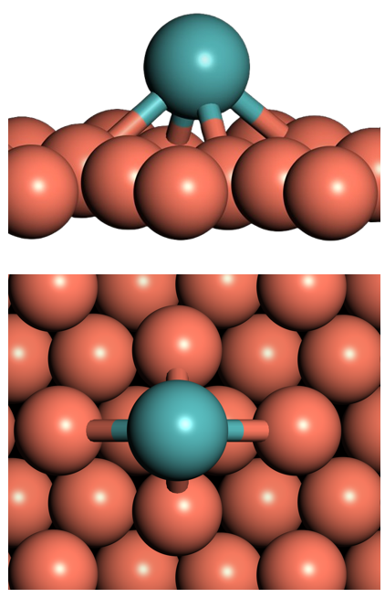
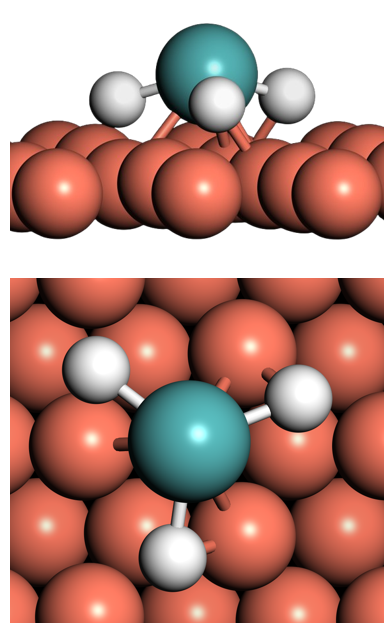
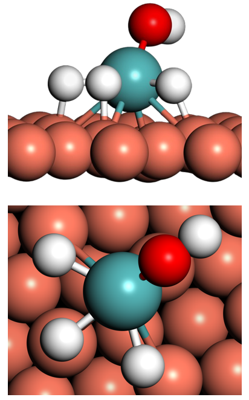
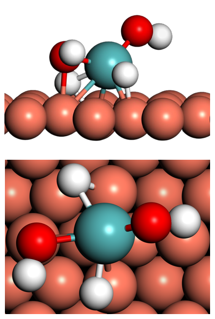
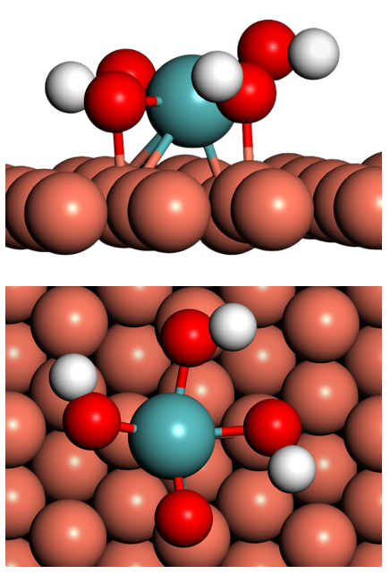

# TAIP map of HER-relevant Mo complexes Adsorbed on Cu(111)

Construct a **field-corrected surface Pourbaix (potential–pH) diagram** from
first-principles energies by sampling the potential–pH plane on a grid of tiles
and, in each tile, keeping the species with the lowest free energy.

This is the field-aware counterpart of the
[iridium-pourbaix-tiles](../case1-iridium-pourbaix-tiles) workflow: the same
tile-and-rank construction, with each species additionally responding to the local
interfacial electric field.

## The problem

A Pourbaix diagram shows which species is most stable as a function of electrode
potential `U` and `pH`. Built analytically, it requires — for every pair of
candidate species — writing the acid–base (`pKa`) and redox (Nernst) equilibrium
conditions and intersecting the resulting lines. At an electrified interface there
is a further effect: each adsorbate also sits in a local electric field that
shifts its energy, and that field itself depends on `U` and `pH`.

## The approach

Two ingredients set each species' free energy at a point `(U, pH)`.

**1. Proton-coupled electron transfer (computational hydrogen electrode):**

```
G(U) = G_system - G_Mo - m*G_H2O + (m - n/2)*G_H2 + (n - 2m)*q*U
```

with `m` = number of oxygen atoms in the complex, `n` = number of hydrogen atoms in
the complex, `q` = atomic unit of charge (= 1).
Potential `U` is referenced to RHE.

**2. The local interfacial field.** A Helmholtz double-layer model maps `U` and
`pH` onto the field at the adsorbate, which shifts its energy through a dipole `mu`
and polarizability `alpha`:

```
E(U, pH) = C_H * (U - kT*ln10*pH/e - U_PZC) / (eps * eps0)        [V/m]
G_field  = G(U) + mu*E - (alpha/2)*E**2
```

| Symbol       | Meaning                                            | Value             |
|--------------|----------------------------------------------------|-------------------|
| `C_H`        | Helmholtz capacitance                              | 0.25 F/m²         |
| `U_PZC`      | potential of zero charge                           | −0.70 V           |
| `eps`,`eps0` | inner-layer / vacuum permittivity                  | 2, 8.854e−12 F/m  |
| `mu`         | surface dipole of the species (rel. to Mo)         | fitted (step 1)   |
| `alpha`      | polarizability of the species (rel. to Mo)         | fitted (step 1)   |

`mu` and `alpha` are obtained in step 1 by fitting a DFT field scan to
`dG_rel(E) = mu*E − (alpha/2)*E²` (each species relative to the bare Mo reference).

The diagram then follows in three steps:

1. lay a fine grid over the potential–pH plane;
2. evaluate `G_field` for every species at the center of each tile;
3. assign each tile to the species with the lowest `G_field` and color it accordingly.

A phase boundary is the locus where the lowest-energy species changes; it is read
off the grid rather than solved for. The physical inputs are the species energies
and the double-layer parameters (`C_H`, `U_PZC`, `eps`), so the diagram inherits
both the level of theory of the energies and the choice of double-layer model.

## Application: MoOₘHₙ on Cu(111) under alkaline HER

We apply the workflow to molybdenum hydride/oxyhydride species on a copper support:

> Kambale, E. M.; Rivera Rocabado, D. S.; Kanematsu, Y.; Ishimoto, T.
> *Field-Dependent Redox Thermodynamics of MoOₘHₙ Species on Cu(111) and Ni(111)
> Surfaces under Alkaline Hydrogen Evolution Conditions.* Preprints.org, 2026.
> DOI: [10.20944/preprints202604.0944.v1](https://doi.org/10.20944/preprints202604.0944.v1)

Geometries and energies are from periodic plane-wave DFT (**VASP**). Four
adsorbates compete across the `U`–`pH` plane — `H3Mo`, `H3MoOH`, `H2MoOH2`, and
`MoOOH3` — differing in their water (`m`) and hydrogen (`n`) counts.

### Surface species

The bare Mo reference and the four adsorbed MoOₘHₙ structures on Cu(111) (each
panel shows the side view above the top view):

<table>
<tr>
  <td align="center"><br><b>Mo</b> (reference)</td>
  <td align="center"><br><b>H₃Mo</b></td>
  <td align="center"><br><b>H₃MoOH</b></td>
  <td align="center"><br><b>H₂MoOH₂</b></td>
  <td align="center"><br><b>MoO(OH)₃</b></td>
</tr>
</table>

<sub>Teal = Mo, red = O, white = H, copper = Cu(111) substrate.</sub>

The resulting field-corrected diagram (potential vs. RHE):

<p align="center">
  
</p>

## Repository layout

```
cu-mo-field-pourbaix-tiles/
├── data/
│   ├── total_energy_vs_field.csv       # DFT (VASP) total energies vs applied field
│   ├── formation_terms_cu111.csv       # G_system, G_Mo, G_H2O, G_H2, m, n per species
│   ├── field_response_fit.csv          # mu, alpha per species (from step 1)
│   └── README.md                       # data dictionary + provenance
├── img/                                # structure images: Mo reference + four adsorbates
├── scripts/
│   ├── step1_fit_field_response.py     # field scan -> mu, alpha per species
│   ├── step2_rank_stability_grid.py    # mu/alpha + formation terms -> winner per tile
│   └── step3_plot_pourbaix_diagram.py  # stability grid -> field-corrected Pourbaix diagram
├── results/
│   └── pourbaix_diagram_cu111.png      # (stability_grid_*.csv is regenerated, not committed)
├── requirements.txt
├── LICENSE
└── README.md
```

## Usage

```bash
pip install -r requirements.txt

python scripts/step1_fit_field_response.py      # data/field_response_fit.csv
python scripts/step2_rank_stability_grid.py     # results/stability_grid_cu111.csv
python scripts/step3_plot_pourbaix_diagram.py   # results/pourbaix_diagram_cu111.png
```

Each script has a configuration block at the top — potential/pH window, grid
resolution, double-layer constants, and colors — so the diagram can be re-tuned
without touching the logic.

## Citation

If you use this method or workflow, please cite:

> Kambale, E. M.; Rivera Rocabado, D. S.; Kanematsu, Y.; Ishimoto, T.
> *Field-Dependent Redox Thermodynamics of MoOₘHₙ Species on Cu(111) and Ni(111)
> Surfaces under Alkaline Hydrogen Evolution Conditions.* Preprints.org, 2026.
> DOI: [10.20944/preprints202604.0944.v1](https://doi.org/10.20944/preprints202604.0944.v1)

## License

Released under the MIT License (see `LICENSE`).
